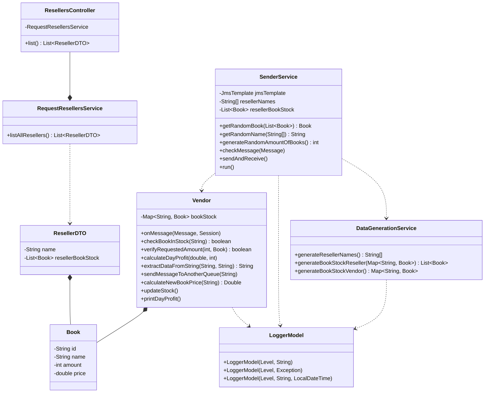

<h4 align="center"> 
  
  
  
</h4>

<p align="center">

</p>

---

## 🖥️ About
This is a Spring Boot application that simulates a book reselling system, where resellers can request books from a vendor. The application consists of different components that work together to handle the book request, stock management, and logging processes. It uses IBM MQ to put the book requests into a message queue, which ensures reliable communication between different parts of the systemm.

### Key Features

- **Reseller Request Handling:** The application simulates resellers sending book requests to a vendor queue. The requests include information such as the reseller name, requested book ID, book name, and requested amount.
  
- **Vendor Response:** The vendor processes the incoming requests, verifies the availability of the requested books, calculates the new book prices, updates the stock, and sends a response back to the reseller with the transaction details.
  
- **Stock Management:** The vendor manages the book stock and updates it at regular intervals by adding new units to each book's available quantity.
  
- **Profit Calculation:** The application calculates the day's profit based on the book sales and logs the current profit at regular intervals.
  
- **Logging:** The application incorporates a logging utility to log messages, exceptions, and other relevant information during the execution.
  
- **Scheduling:** Spring's scheduling features are utilized to run certain tasks, such as updating the stock and logging the day's profit, at fixed intervals.
  
- **REST API:** A REST API endpoint is provided to retrieve a list of resellers and their respective book stocks.

---

## 🔨 Tech heap 
- [x] Java 17
- [x] Docker
- [x] Java Message Service (JMS) 
- [x] IBM MQ
- [x] SpringBoot
- [x] Lombok
- [x] Maven


---

## 🚧 Project Structure
```plaintext
src/main/java/com/ibmmq/messageflow
├── controller
│   └── ResellersController.java
├── dto
│   └── ResellerDTO.java
├── model
│   ├── Book.java
│   ├── LoggerModel.java
│   └── Vendor.java
├── service
│   ├── DataGenerationService.java
│   ├── RequestResellersService.java
│   └── SenderService.java
├── MessageflowApplication.java
└── ResellerApp.java
```

#### com.ibmmq.messageflow.controller 
Contains the ResellersController class, which is a REST controller that provides an endpoint for retrieving resellers' information.

#### com.ibmmq.messageflow.dto
Contains the ResellerDTO class, which is a **Data Transfer Object** used to transfer reseller data between the service and controller layers.

#### com.ibmmq.messageflow.model
Contains the Book class, which represents a book in the system, and the Vendor class, which handles book requests and stock management.
Also includes the LoggerModel classes.

#### com.ibmmq.messageflow.service
Contains the RequestResellersService class, which retrieves resellers' information and their book stocks.
Also includes the SenderService class, which simulates resellers sending book requests to the vendor.
The DataGenerationService class is responsible for generating sample data, such as reseller names and book stocks.
#### com.ibmmq.messageflow
Contains the ResellerApp class, which is the main entry point of the Spring Boot application.

---

## 📝 BookHub Class Diagram


This diagram shows the relationships between the classes involved in the project:

- **```ResellersController```** uses **```RequestResellersService```** to retrieve a list of **```ResellerDTO```** objects.
  
- **```RequestResellersService```** interacts with **```ResellerDTO```** and **```Book```** to create the JSON list of resellers and their book stock.
  
- **```ResellerDTO```** contains a reseller's name and a list of **```Book```** objects representing their book stock.
  
- **```Book```** is a model class representing a book with properties like id, name, amount, and price.
  
- **```Vendor```** manages the book stock (`Map<String, Book>`) and performs different operations related to book requests and stock updates.
  
- **```SenderService```** uses **```Vendor```** to receive messages and **```DataGenerationService```** to generate random data.
  
- **```DataGenerationService```** is responsible for generating reseller names, book stock for resellers, and book stock for the vendor.
  
- **```LoggerModel```** is a utility class for logging purposes, used by **```Vendor```**, **```SenderService```**, and **```DataGenerationService```**.

---

## ▶️ How to run this application?

#### 1) Prerequisites
- You need to have Java Development Kit (JDK) installed on your system. This application requires Java 8 or higher.
  
- Install Apache Maven, which is a build automation tool for Java projects.
  
- Install an Integrated Development Environment (IDE) of your choice, such as IntelliJ IDEA, Eclipse, or Visual Studio Code (with appropriate Java extensions).
  
- Install Docker, you need it to run the contianer with IBM MQ settings.
  
- Install git, you need it to clone this repostiory

#### 2) Clone the repository

- Open a terminal or command prompt.
- Navigate to the directory where you want to clone the project.
- Run the following command to clone the repository:
```git
git clone https://github.com/JayCesar/message-flow-challenge.git
```


#### 2) Run the IBM MQ Image
- Navigate to the root directory of the application and run the following command
```git
docker compose up
```
You will see messages like the following in your terminal:


Obs: It will start the specific service defined in the Docker Compose file.

#### 4) Import the project into your IDE

- Open your IDE.
  
- Choose the option to import an existing project (e.g., "Open" or "Import Project" in IntelliJ, "Import" in Eclipse).
  
- Navigate to the directory where you cloned the project and select the project folder.
  
- Follow the prompts in your IDE to import the project.

e.g Intelij:
  


#### 5) Set up the required dependencies

- Most modern IDEs automatically detect and download the required dependencies specified in the project's pom.xml file (for Maven projects).
  
- If your IDE doesn't automatically download the dependencies, you can manually trigger a Maven build or update by following the IDE's specific instructions.
  


#### 6) Run the application
- Locate the main class of the application: **ResellerApp**.
  
- In your IDE, right-click on the main class and select the option to run the application (e.g., "Run" or "Run As Java Application").
  
- If everything is set up correctly, the application should start running, and you should see the logs in your IDE's console or terminal. As the example below:


#### 7) Test the application

- **By endpoint**
   - Once the application is running, you can test the various functionalities by sending a HTTP GET request to the exposed endpoint: `http://localhost:8080/resellerapp/resellers`. It will retrive the list of resellers.
     
   - Cpen your browser then copy and paste the link: `http://localhost:8080/resellerapp/resellers`. You see a JSON like this:


   - The stock of books is updated every 60 seconds (1 minute) according to the business logic, and the price of the books changes whenever a reseller requests it.

- **By logs**
  - In your IDE terminal, you will see various types of logs:
    
   - Every 1 minute, a log entry for stock updates.
     
   - Every 20 seconds, a log entry for the day's profit of the vendor.
     
   - Logs for messages (books requesteds) received by the producer (Vendor class).
     
   - Logs for when the amounb of books is superior thatn available in stock
     
   - Logs for any exceptions that may occur.
  
   

---

## 🧠 Business Logic - How does it work?

This is a Request-Response pattern application, which means that the messages sent to a queue will be processed and a response will be generated. 
It all starts with the ```DataGenerationService``` class, which generates the names of the resellers, the names of the books, and the quantities of books available in both the resellers' and the vendor's stock. All methods are static, eliminating the need to instantiate this class.

---

### DataGenerationService methods

```generateResellerNames():``` 

Generates an array of reseller names. They are used inside the sent messages to the producer (Vendor);

```java
    public static String[] generateResellerNames() {
        return new String[]{
                "BookWave",
                "PageTurner",
                "ReadHub",
                "LitHaven",
                "NovelNest",
                "StorySource",
                "ProsePicks",
                "ChapterChoice",
                "BestsellerBarn",
                "NarrativeNook"
        };
    }
```

```generateRandomId(int cont):```

Generates and random ID used to instantiate the class Book

```java
  public static String generateRandomId(int cont) {
        String id = UUID.randomUUID().toString().replaceAll("-", "").substring(0, 6) + cont;
        if(id.length() == 7) id+=cont;
        return id;
    }
```

```generateBookStockVendor():```

Generates a map of Book objects representing the book stock for the vendor.
```java
public static Map<String, Book> generateBookStockVendor() {

        Map<String, Book> bookVendorStock = new HashMap<>();

        String[] titles = generateBookTitles();

        for (int i = 0; i < titles.length; i++) {
            String id = generateRandomId(i);
            String name = titles[i];
            Double price = 20.0 + (i * 1.5);

            Book book = new Book(id, name, price, BOOKS_INITIAL_AMOUNT);
            bookVendorStock.put(book.getId(), book);
        }

        return bookVendorStock;

    }
```

```generateBookStockReseller(Map<String, Book>):```

Generates a list of Book objects representing the book stock for the resellers. The books and their quantities will match those of the Vendor, as the Vendor's stock is static and can be accessed without instantiation. This is crucial because resellers only "resell" the books.

```java
 public static List<Book> generateBookStockReseller(Map<String, Book> bookVendorStock) {

        List<Book> bookVendorList = new ArrayList<>();
        for (Map.Entry<String, Book> entry : bookVendorStock.entrySet()) {
            Book resellerBook = new Book(entry.getValue().getId(), entry.getValue().getName(), entry.getValue().getPrice(), entry.getValue().getAmount());
            bookVendorList.add(resellerBook);
        }
        return bookVendorList;
    }
```

```generateBookTitles():```

Generates an array of book names. They are used to instantiate the books classes.

```java
public static String[] generateBookTitles() {
        return new String[]{
                "To Kill a Mockingbird",
                "Harry Potter",
                "1984",
                "Pride and Prejudice",
                "The Great Gatsby",
                "Moby Dick",
                "War and Peace",
                "The Odyssey",
                "Crime and Punishment",
                "The Catcher in the Rye",
                "The Hobbit",
                "Fahrenheit 451",
                "The Lord of the Rings",
                "Jane Eyre",
                "Brave New World",
                "Animal Farm",
                "The Brothers Karamazov",
                "Wuthering Heights",
                "Les Misérables",
                "The Count of Monte Cristo",
                "The Divine Comedy",
                "The Adventures of Huckleberry Finn",
                "Alice's Adventures in Wonderland",
                "Great Expectations",
                "One Hundred Years of Solitude",
                "The Picture of Dorian Gray",
                "Frankenstein",
                "The Grapes of Wrath",
                "Ulysses",
                "Madame Bovary",
                "Dracula"
        };
    }
```

--- 

Then comes the **SenderService** class that uses these generated data and send them - after instantiation (Resellers and Books) - as messages to the producer **Vendor**:

### SenderService methods

```public SenderService(JmsTemplate jmsTemplate():```

This is the constructor.It takes a JmsTemplate object as a parameter and assigns it to the jmsTemplate field.

```java
public SenderService(JmsTemplate jmsTemplate) {
    this.jmsTemplate = jmsTemplate;
}
```

```private static Book getRandomBook(List<Book> resellerBookList):```

This static method takes a list of Book objects (resellerBookList) and returns a random Book object from the list. It does this by creating a Random object, generating a random index within the bounds of the list size, and returning the Book object at that index.

```java
private static Book getRandomBook(List<Book> resellerBookList) {
    Random random = new Random();
    int randomIndex = random.nextInt(resellerBookList.size());
    return resellerBookList.get(randomIndex);
}
```

```private static Book getRandomName(String[] resellerNames):```

This static method takes an array of reseller names (resellerNames) and returns a random reseller name from the array. It follows a similar approach to getRandomBook(...), where it creates a Random object, generates a random index within the bounds of the array length, and returns the reseller name at that index.

```java
private static String getRandomName(String[] resellerNames) {
    Random random = new Random();
    int randomIndex = random.nextInt(resellerNames.length);
    return resellerNames[randomIndex];
}
```

```public int generateRandomAmountOfBooks():```

This method generates a random amount of books to request. It creates a Random object and uses the nextInt(int bound) method to generate a random integer between 0 (inclusive) and 7 (exclusive). It then adds 1 to ensure the random amount is between 1 and 7 (inclusive).

```java
public int generateRandomAmountOfBooks() {
    Random random = new Random();
    int randomAmount = random.nextInt(7) + 1;
    return randomAmount;
}
```

```public void checkMessage(Message replyMsg):```

This method checks the reply message received from the Vendor. If the replyMsg is not null, it casts it to a TextMessage and attempts to retrieve the text content. If an exception occurs during this process, it creates a LoggerModel instance with the SEVERE level and the caught exception. If the replyMsg is null, it creates a LoggerModel instance with the WARNING level, a log message indicating that no response was received, and the current timestamp.


```java
public void checkMessage(Message replyMsg) {
    if (replyMsg != null) {
        TextMessage textReplyMsg = (TextMessage) replyMsg;
        String confirmationMessage = null;
        try {
            confirmationMessage = textReplyMsg.getText();
        } catch (JMSException e) {
            new LoggerModel(Level.SEVERE, e);
        }
    } else {
        String logMsg = "No response received";
        new LoggerModel(Level.WARNING, logMsg, LocalDateTime.now());
    }
}
```

```public void sendAndReceive():```

This method is annotated with @Scheduled(fixedRate = 5000), which means it will be executed repeatedly at a fixed rate of 5000 milliseconds (5 seconds).

The method performs the following tasks:

1) Sets the receive timeout for the jmsTemplate to 2 seconds.
   
3) Retrieves a random reseller name using the getRandomName(...) method.
   
5) Retrieves a random book from the reseller's book stock using the getRandomBook(...) method.
   
7) Generates a random amount of books to request using the generateRandomAmountOfBooks() method.
   
9) Constructs a message request string with the reseller name, requested book ID, requested book name, and requested amount.
    
11) Sends the message request to the BOOKS_QUEUE using the sendAndReceive(...) method of the jmsTemplate. This method also receives a reply message from the queue.
    
13) Calls the checkMessage(...) method with the received reply message to handle any errors or log messages.

```java
@Scheduled(fixedRate = 5000)
public void sendAndReceive() {
    jmsTemplate.setReceiveTimeout(2 * 1000);
    String resselerName = getRandomName(resellerNames);
    Book pickedResellerBook = getRandomBook(resellerBookStock);
    int amountRequested = generateRandomAmountOfBooks();

    String messageRequest =
            "ResselerName: " + resselerName + "\n" +
                    "RequestedBookId: " + pickedResellerBook.getId() + "\n" +
                    "RequestedBookName: " + pickedResellerBook.getName() + "\n" +
                    "RequestedAmount: " + amountRequested;

    Message replyMsg = jmsTemplate.sendAndReceive(BOOKS_QUEUE, session -> {
        TextMessage message = session.createTextMessage(messageRequest);
        return message;
    });

    checkMessage(replyMsg);
}
```

```public void run():```

This method overrides the run() method from the Thread class. When the SenderService thread is started, this run() method will be executed, which in turn calls the sendAndReceive() method.

```java
@Override
public void run() {
    sendAndReceive();
}
```

--- 

### Vendor methods

```public void onMessage(Message msg, Session):```

This method is a **JMS message listener** annotated with **@JmsListener(destination = BOOKS_QUEUE)**. It is invoked when a message arrives in the BOOKS_QUEUE. The method performs the following tasks:

- Extracts the reseller name, requested book ID, and requested amount from the incoming message using the extractDataFromString method.
  
- Checks if the requested book is in stock using the checkBookInStock method.
  
- Verifies if the requested amount is available using the verifyRequestedAmount method.
  
- If the requested amount is available, it calculates the new book price using the calculateNewBookPrice method, updates the stock, calculates the day's profit using the calculateDayProfit method, and constructs a reply message with the transaction details.
  
- If the requested amount exceeds the available stock, it sends a message to another queue **(DEV.QUEUE.2)** using the **sendMessageToAnotherQueue** method.
  
- Sends the reply message back to the sender using the JMSReplyTo destination.
  
- Logs the transaction details or any exceptions using the LoggerModel class.

```java
    @JmsListener(destination = BOOKS_QUEUE)
    public void onMessage(Message msg, Session session) {
        String text = null;
        String replyVendor = null;
        String logMessage = null;

        try {
            if (msg instanceof TextMessage) text = ((TextMessage) msg).getText();
            else text = msg.toString();

            TextMessage replyMsg = null;

            String resellerName = extractDataFromString(text, RESELLER_NAME);
            String bookIdRequested = extractDataFromString(text, BOOK_ID);
            int requestedAmount = Integer.parseInt(extractDataFromString(text, AMOUNT));
            Book requestedBook = bookStock.get(bookIdRequested);

            if (checkBookInStock(bookIdRequested)) {
                if (verifyRequestedAmount(requestedAmount, requestedBook)) {

                    double newPrice = calculateNewBookPrice(requestedBook.getId());
                    double oldPrice = requestedBook.getPrice();

                    calculateDayProfit(newPrice, requestedAmount);

                    int currentAmount = requestedBook.getAmount();
                    requestedBook.setAmount(currentAmount - requestedAmount);

                    double totalPriceToPay = requestedAmount * newPrice;

                    replyVendor = "Reseller: " + resellerName
                            + ", BookId: " + requestedBook.getId()
                            + ", Requested book: " + requestedBook.getName()
                            + ", Available in Stock: " + currentAmount
                            + ", Requested Amount: " + requestedBook.getAmount()
                            + ", Old Price: R$" + String.format("%.2f", oldPrice)
                            + ", Current Price: R$" + String.format("%.2f", newPrice)
                            + ", TOTAL: R$ " + String.format("%.2f", totalPriceToPay);

                    logMessage = replyVendor;

                    new LoggerModel(Level.INFO, logMessage, LocalDateTime.now());
                } else {
                    logMessage = "The quantity of requested books exceeds the available stock. Please check the inventory and adjust the quantity as needed.";
                    replyVendor = "Requested amount exceeds available stock";
                    sendMessageToAnotherQueue(text);
                    new LoggerModel(Level.WARNING, logMessage, LocalDateTime.now());
                }
            }

            final String msgID = msg.getJMSMessageID();
            MessageProducer replyDest = session.createProducer(msg.getJMSReplyTo());
            replyMsg = session.createTextMessage(replyVendor);
            replyMsg.setJMSCorrelationID(msgID);
            replyDest.send(replyMsg);

        } catch (JMSException e) {
            new LoggerModel(Level.WARNING, e);
        }

    }
```

```public boolean checkBookInStock(String bookIdRequested):```

This method checks if a book with the given ID is in stock and if the available quantity is greater than or equal to 1. It returns true if the book is in stock and has a positive quantity, false otherwise.


```java
public boolean checkBookInStock(String bookIdRequested) {
    if (bookStock.containsKey(bookIdRequested)) {
        Book requested = bookStock.get(bookIdRequested);
        if (requested.getAmount() >= 1) return true;
    }
    return false;
}
```

```public boolean verifyRequestedAmount(int requestedAmount, Book requestedBook):```

This method verifies if the requested amount of books is less than or equal to the available stock for the given book. It returns true if the requested amount is valid, false otherwise.

```java
public boolean verifyRequestedAmount(int requestedAmount, Book requestedBook) {
    if (requestedAmount > requestedBook.getAmount()) return false;
    return true;
}
```
```calculateDayProfit(double newPrice, int requestedAmount):```

This method calculates the profit for a sale based on the new price and the requested amount of books. It updates the **dayProfit** static variable with the calculated profit.

```java
public void calculateDayProfit(double newPrice, int requestedAmount) {
    double profitSale = newPrice * requestedAmount;
    dayProfit += profitSale;
}
```

```extractDataFromString(String text, String typeData):```

This method extracts data (reseller name, book ID, or requested amount) from the incoming message string using regular expressions. It returns the extracted data as a string.

```java
  public String extractDataFromString(String text, String typeData) {
        String requestedData = null;
        Pattern pattern = null;
        Matcher macther = null;

        if (typeData.equalsIgnoreCase(BOOK_ID)) {
            pattern = Pattern.compile("RequestedBookId: (\\w+)");
            macther = pattern.matcher(text);
            requestedData = macther.find() ? macther.group(1) : "";
        }

        if (typeData.equalsIgnoreCase(RESELLER_NAME)) {
            pattern = Pattern.compile("ResselerName: (\\w+)");
            macther = pattern.matcher(text);
            requestedData = macther.find() ? macther.group(1) : "";
        }

        if (typeData.equalsIgnoreCase(AMOUNT)) {
            pattern = Pattern.compile("RequestedAmount: (\\w+)");
            macther = pattern.matcher(text);
            requestedData = macther.find() ? macther.group(1) : "";
        }

        return requestedData;
    }
```

```sendMessageToAnotherQueue(String payload):```

This method sends a message to another queue **(DEV.QUEUE.2)** using the JmsTemplate. It creates a TextMessage with the provided payload and sends it to the specified queue.

```java
private void sendMessageToAnotherQueue(String payload) {
    jmsTemplate.send("DEV.QUEUE.2", new MessageCreator() {
        @Override
        public Message createMessage(Session session) throws JMSException {
            TextMessage message = session.createTextMessage(payload);
            return message;
        }
    });
}
```

```calculateNewBookPrice(String requestedBook):```

This method calculates the new price for a book by increasing the current price by 5%. It updates the book's price in the bookStock and returns the new price.

```java
public Double calculateNewBookPrice(String requestedBook) {
    Book bookRequested = bookStock.get(requestedBook);
    double newPrice = bookRequested.getPrice();
    newPrice += (newPrice * 0.05);
    bookRequested.setPrice(newPrice);
    return newPrice;
}
```


```updateStock():```

This method is annotated with **@Scheduled(fixedRate = 60000)**, which means it will be executed repeatedly at a fixed rate of 60000 milliseconds (1 minute). It updates the stock of all books by adding 2 units to each book's available quantity. It also logs a "Stock Updated" message using the LoggerModel class.

```java
@Scheduled(fixedRate = 60000)
public static void updateStock() {
    for (Map.Entry<String, Book> entry : bookStock.entrySet()) {
        int currentAmount = entry.getValue().getAmount();
        entry.getValue().setAmount(currentAmount += 2);
    }
    String message = "Stock Updated";
    new LoggerModel(Level.INFO, message, LocalDateTime.now());
}

```

```printDayProfit():```

This method is annotated with @Scheduled(fixedRate = 20000), which means it will be executed repeatedly at a fixed rate of 20000 milliseconds (20 seconds). It formats the dayProfit value and logs a message with the current day's profit using the LoggerModel class.

```java
@Scheduled(fixedRate = 20000)
public void printDayProfit() {
    String formatedProfit = String.format("%.3f", dayProfit);
    String logMessage = "Day profit thus far: R$ " + formatedProfit;
    new LoggerModel(Level.INFO, logMessage, LocalDateTime.now());
}
```

---

### Other classes:

**LoggerModel:** Used to print log messages.

**ResellersController:** Used to access and list resellers and their stock.

**ResellerDto:** Used to populate data that will be accessed via RESTful API.

--- 

