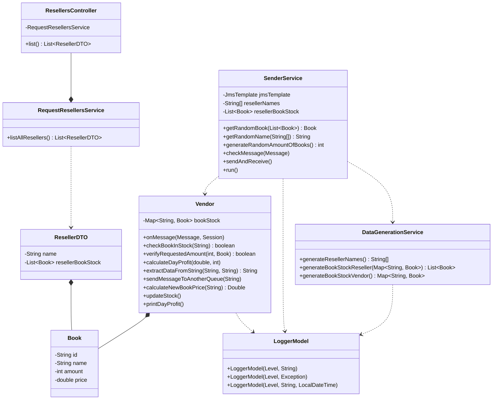

<h4 align="center"> 
  
  
  
</h4>

<p align="center">

</p>

---

### 🖥️ About
This is a Spring Boot application that simulates a book reselling system, where resellers can request books from a vendor. The application consists of different components that work together to handle the book request, stock management, and logging processes. It uses IBM MQ to put the book requests into a message queue, which ensures reliable communication between different parts of the system

---

### 🚧 Project Structure
```plaintext
src/main/java/com/ibmmq/messageflow
├── controller
│   └── ResellersController.java
├── dto
│   └── ResellerDTO.java
├── model
│   ├── Book.java
│   ├── LoggerModel.java
│   └── Vendor.java
├── service
│   ├── DataGenerationService.java
│   ├── RequestResellersService.java
│   └── SenderService.java
├── MessageflowApplication.java
└── ResellerApp.java
```

#### com.ibmmq.messageflow.controller 
Contains the ResellersController class, which is a REST controller that provides an endpoint for retrieving resellers' information.

#### com.ibmmq.messageflow.dto
Contains the ResellerDTO class, which is a **Data Transfer Object** used to transfer reseller data between the service and controller layers.

#### com.ibmmq.messageflow.model
Contains the Book class, which represents a book in the system, and the Vendor class, which handles book requests and stock management.
Also includes the LoggerModel classes.

#### com.ibmmq.messageflow.service
Contains the RequestResellersService class, which retrieves resellers' information and their book stocks.
Also includes the SenderService class, which simulates resellers sending book requests to the vendor.
The DataGenerationService class is responsible for generating sample data, such as reseller names and book stocks.
#### com.ibmmq.messageflow
Contains the ResellerApp class, which is the main entry point of the Spring Boot application.

---

### 📝 BookHub Class Diagram


This diagram shows the relationships between the classes involved in the project:

- **```ResellersController```** uses **```RequestResellersService```** to retrieve a list of **```ResellerDTO```** objects.
- **```RequestResellersService```** interacts with **```ResellerDTO```** and **```Book```** to create the JSON list of resellers and their book stock.
- **```ResellerDTO```** contains a reseller's name and a list of **```Book```** objects representing their book stock.
- **```Book```** is a model class representing a book with properties like id, name, amount, and price.
- **```Vendor```** manages the book stock (`Map<String, Book>`) and performs different operations related to book requests and stock updates.
- **```SenderService```** uses **```Vendor```** to receive messages and **```DataGenerationService```** to generate random data.
- **```DataGenerationService```** is responsible for generating reseller names, book stock for resellers, and book stock for the vendor.
- **```LoggerModel```** is a utility class for logging purposes, used by **```Vendor```**, **```SenderService```**, and **```DataGenerationService```**.

---

### ▶️ How to run this application?

#### 1) Prerequisites
- You need to have Java Development Kit (JDK) installed on your system. This application requires Java 8 or higher.
- Install Apache Maven, which is a build automation tool for Java projects.
- Install an Integrated Development Environment (IDE) of your choice, such as IntelliJ IDEA, Eclipse, or Visual Studio Code (with appropriate Java extensions).
- Install Docker, you need it to run the contianer with IBM MQ settings.
- Install git, you need it to clone this repostiory

#### 2) Clone the repository

- Open a terminal or command prompt.
- Navigate to the directory where you want to clone the project.
- Run the following command to clone the repository:
```git
git clone https://github.com/JayCesar/message-flow-challenge.git
```


#### 2) Run the IBM MQ Image
- Navigate to the root directory of the application and run the following command
```git
docker-compose up ibm-mq
```
You will see messages like the following in your terminal:


Obs: It will start the specific service defined in the Docker Compose file.

#### 4) Import the project into your IDE

- Open your IDE.
- Choose the option to import an existing project (e.g., "Open" or "Import Project" in IntelliJ, "Import" in Eclipse).
- Navigate to the directory where you cloned the project and select the project folder.
- Follow the prompts in your IDE to import the project.
- e.g Intelij:
  


#### 5) Set up the required dependencies

- Most modern IDEs automatically detect and download the required dependencies specified in the project's pom.xml file (for Maven projects).
- If your IDE doesn't automatically download the dependencies, you can manually trigger a Maven build or update by following the IDE's specific instructions.


#### 6) Run the application
- Locate the main class of the application: **ResellerApp**.
- In your IDE, right-click on the main class and select the option to run the application (e.g., "Run" or "Run As Java Application").
- If everything is set up correctly, the application should start running, and you should see the logs in your IDE's console or terminal. As the example below:


