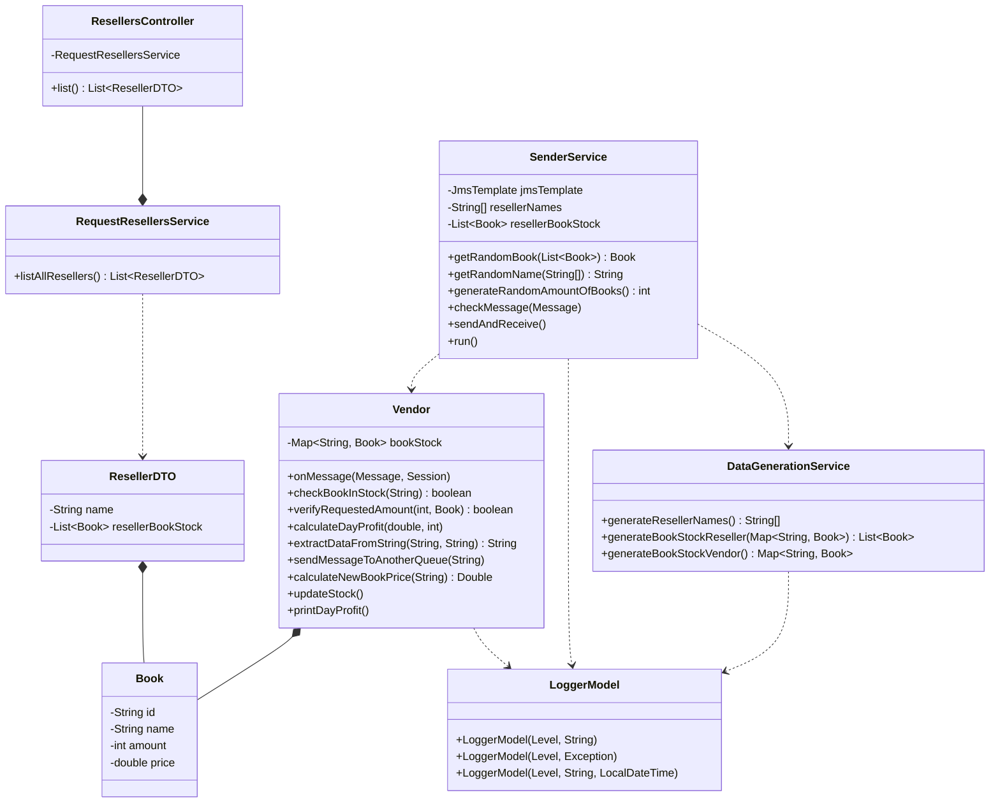

### 🖥️ About
This is a Spring Boot application that simulates a book reselling system, where resellers can request books from a vendor. The application consists of different components that work together to handle the book request, stock management, and logging processes. It uses IBM MQ to put the book requests into a message queue, which ensures reliable communication between different parts of the system

### 📝 BookHub Class Diagram

